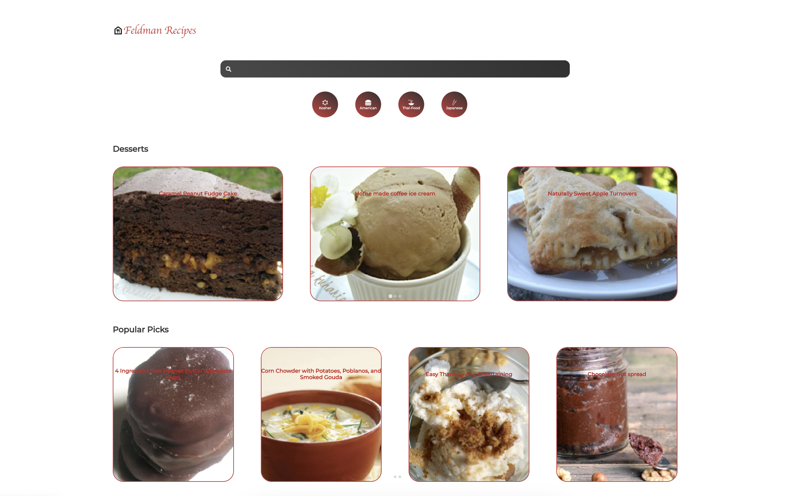

# Family Recipe Book

## Project Description

This project was created as part of an a larger project to create a home for the collection of family recipes. The goal was to save the constant searching for the family favorites with a centralized location for all the recipes. This project was created using the [Spoonacular API](https://spoonacular.com/food-api). 

    

## Next Steps

The next steps are to personalize this recipe book by creating an API with the family recipes.
